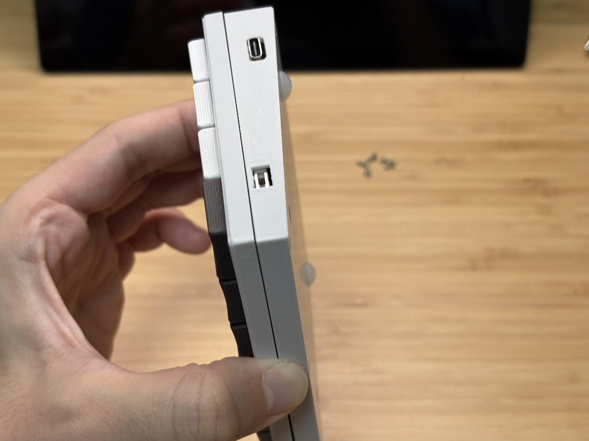

# PEKS48ビルドガイド
自作キーボードキットPEKS48のビルドガイドです。 
はんだ付け済み、ケース付き、ファームウェア書き込み済みですので、
ネジを締めて頂くだけでお使い頂けます。

## キット内容

| 名称                   | 数  |　補足                                  |
| ---------------------- | --- | ---                                   |
| メイン基板              | 2   |マイコンなど実装済み                     |
| FR-4製トッププレート    | 2   |                                        |
| Li-Poバッテリ          | 2   |                                        |
| ケース(ボトム)          | 1   |                                       |
| ケース(トップ)          | 1   |                                       |
| ガスケット用フォーム     |  -  |ケース及び基板の必要個所に取付済み        |
| M2ネジ                 | 12   |                                       |
| M2ナット               | 12   |                                       |
| ゴム足                 | 4    |                                       |
| 給電ドッグ             | 1    |無線給電機能付きの場合                   |

## キット以外に必要なもの

| 名称                     | 数  |　補足         |
| ----------------------   | --- | ---          |
| キースイッチ              | 66  |choc v2互換　　|
| PC接続用USB Type Cケーブル| 1   |　           　|

## 組み立て手順
以下の状態で郵送されます（右手用）。 
ネジも既に締められた状態です。 
 

キーキャップをとると右用か左用かが書かれています。 
PEKS48はハードウェアとしては右も左も完全に同じものです。ファームウェアのみ異なります。 
 

裏返すと6か所にネジがあるので外します。 
ネジを外すとケース(トップ) が外せます。 
右の図はケース(トップ) を外した状態です。 
 

次に、メイン基板の下側にバッテリが入っていますので、メイン基板と接続します。 
 

バッテリがコネクタや無線給電用子基板と干渉しないように配置して、メイン基板をケースに収めます。 
その際、以下のようにケーブルをケースと基板の間に挟まないように注意してください。 
 

次に、トッププレートにスイッチをはめていきます。 
この時点でキーキャップまではめてもよいです。 
 

ボトムケース、メイン基板＋トッププレート、トップケースの順に重ねてねじを締めます。 
上部からネジがみえないように、トッププレート内部にナットを入れる箇所がありますので、6か所にすべて入れていきます。 
少し細かい作業になるので、ピンセットがあるとやりやすくなると思います。 
 

最後に、ケース（トップ）を基板に被せて、ボトム側からネジを締めれば完成です。 
この際、ナットが落ちないように横向きに回転させると作業しやすいと思います。 
 

完成です！！ 
 

## 初期キー配置
初期のキー配置は

